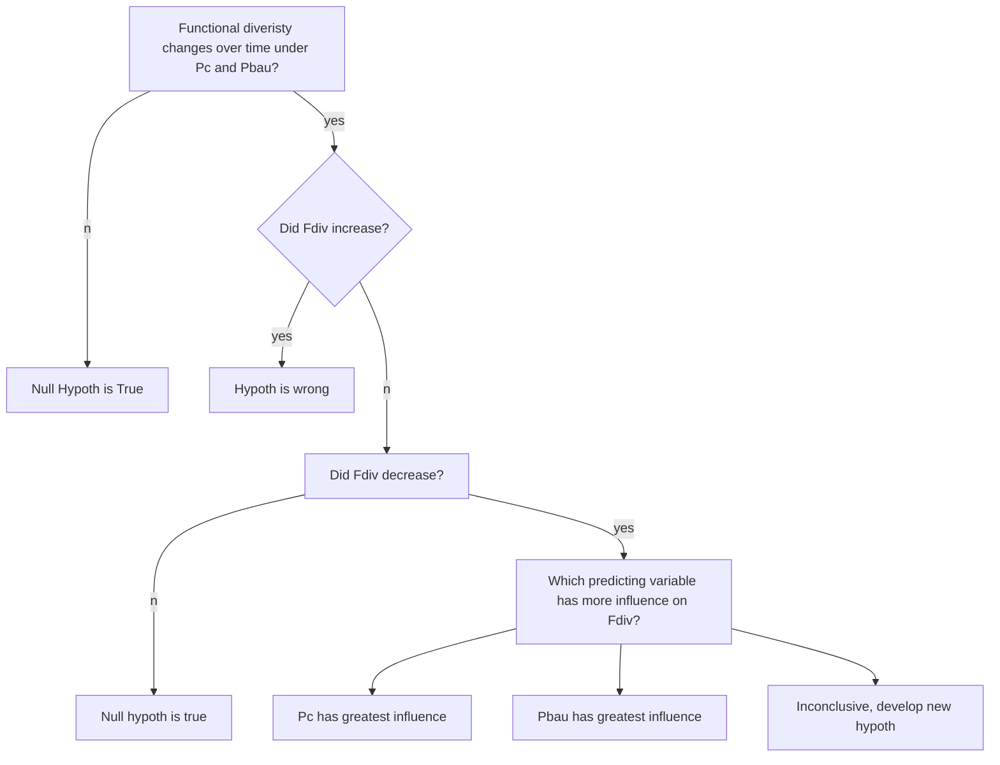

## DIAGRAMS WITH MARKDOWN##

### Matthias Nevins - Univeristy of Vermont###

### February 1, 2017###

- I use the mermaid chart diagram below to replicate a decision tree created to map out a potential outcome of a hypothesis test. My research will be using a forest simulation model to evaluate forest management decisions over time under climate change.

- The hypothesis being testing is: Forest resistance to climate change, measured by functional diveristy (Fdiv), will decrease over under a *high* climate change emmissions scenerio (Pc) and under *buisness as usual* (Pbau) forest management. 

  - The null hypothesis is that *forest resistance over time is not impacted by Pc or Pbau*.

