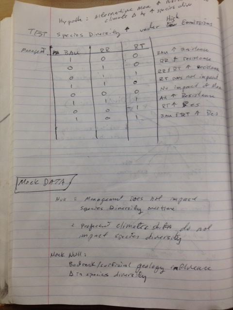

##**Thinking on Paper** 

*The focus of my research is as follows*:

I will be contributing to the work of exploring functional responses in a given forest and relying on forest landscape simulation and climate envelope models as decision support tools for understanding the outcomes of different management regimes and climate projections on future forest conditions. Our study aims to examine and evaluate the long-term effects of three alternative management approaches under two projected climate scenarios within a 10,000-acre forested landscape of mixed-ownerships in southeastern Vermont, USA. 

**My main research questions are:**

* 1: How does species composition change over time under two climate scenarios and three management regimes? 

* 2: How does simulated future forest conditions across the six scenarios compare to the desired future condition identified for the landscape? 

* 3: How do differences in landowner behavior in regards to application of adaptive measures influence landscape-level resilience to climate change?
  

###Path Diagram 
   

###Logic Tree
 

###Look-up-table & Mock Data

